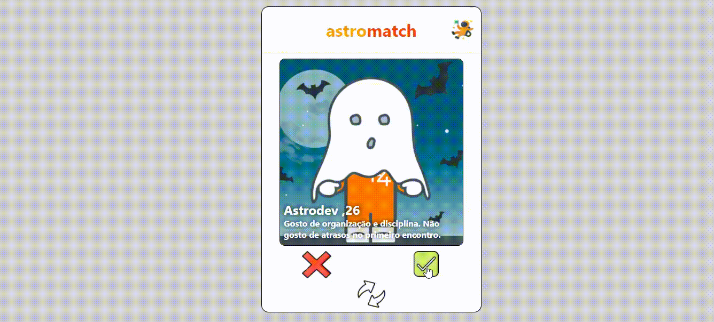

# 💖 Astromatch

The Astromatch project was developed during the Labenu Bootcamp to put into practice the content studied during the course, specifically: Hooks (useState and/or useEffect).

<h1 align="center">

</h1>



---

# Index

- [Description](#-description)
- [How to access ](#-how-to-access)
- [Techs](#-techs)
- [How to download the project](#-how-to-download-the-project)

---

## 🖋 Description

It is a Tinder clone, featuring a profile screen with the option to "match" or reject, a Matches screen consisting of a list of users who have "matched" with the current user, and the ability for the user to reset matches at any time.

---

## 🌎 How to access 

- [Link](https://astro-print-ale.surge.sh/)

## 🚀 Techs

The project was developed using the following technologies:

- [React.js](https://pt-br.reactjs.org/docs/getting-started.html)
- [Styled-Components](https://styled-components.com/docs)
- [Hooks](https://pt-br.reactjs.org/docs/hooks-intro.html)

---

## 💾 How to download the project

- First, install the [Git](https://git-scm.com/), [Node.jS](https://nodejs.org/pt-br/download/) + [npm](https://www.npmjs.com/get-npm)
```bash
# Clone
git clone https://github.com/Ale557333/Astromatch.git

# Enter to the directory 
cd astromatch

# Install the dependencies 
npm install

# Run 🏁
npm run start
```

Developed whit 💙 by Alexandre 🤓
